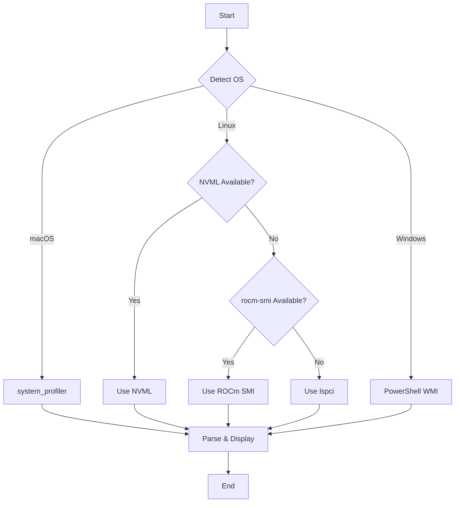

# GPU Info

**A cross-platform GPU information utility for NVIDIA, AMD, Intel, and Apple GPUs**

---

## 📋 Table of Contents

- [Overview](#overview)
- [Features](#features)
- [System Requirements](#system-requirements)
- [Installation](#installation)
- [Usage](#usage)
- [Output Information](#output-information)
- [Platform-Specific Details](#platform-specific-details)
- [Architecture](#architecture)
- [Troubleshooting](#troubleshooting)
- [Contributing](#contributing)
- [License](#license)

---

## 🎯 Overview

**GPU Info** is a comprehensive command-line utility that provides detailed information about graphics processing units (GPUs) across multiple platforms and vendors. Whether you're running macOS with Apple Silicon, Linux with NVIDIA/AMD GPUs, or Windows with any GPU vendor, this tool gives you consistent, detailed hardware information.

### Key Capabilities

- **Cross-Platform**: Works on macOS, Linux, and Windows
- **Multi-Vendor**: Supports NVIDIA, AMD, Intel, and Apple GPUs
- **Detailed Metrics**: Reports GPU cores, clock speeds, memory, bandwidth, and compute performance
- **Multiple Detection Methods**: Uses the most reliable API for each platform

---

## ✨ Features

| Feature | Description |
|---------|-------------|
| **GPU Identification** | Name, vendor, and model detection |
| **Memory Information** | VRAM size and configuration |
| **Performance Metrics** | Clock frequencies, FLOPS, and IPS calculations |
| **Architecture Details** | Core counts, cache sizes, and memory bandwidth |
| **Apple Silicon Support** | Full M1/M2/M3/M4 series detection with specs |
| **Multiple GPU Support** | Detects and reports all GPUs in the system |

---

## 💻 System Requirements

### Minimum Requirements

- **Python**: 3.6 or higher
- **Operating System**: macOS 10.13+, Linux (kernel 3.10+), or Windows 10+

### Platform-Specific Requirements

#### 🍎 macOS
- **Built-in**: No additional requirements
- **Tools Used**: `system_profiler`, `sysctl`

#### 🐧 Linux
- **For Basic Detection**: `lspci` (install via `sudo apt-get install pciutils`)
- **For NVIDIA GPUs**: `pip install nvidia-ml-py` (recommended)
- **For AMD GPUs**: `rocm-smi` (optional, for AMD-specific features)

#### 🪟 Windows
- **Built-in**: PowerShell (pre-installed on Windows 10+)
- **Requirements**: WMI access (enabled by default)

---

## 🚀 Installation

### Step 1: Clone or Download

```bash
# Clone the repository (if applicable)
git clone https://github.com/infrabrew/gpu-info.git
cd gpu-info

# Or download the script directly
wget https://raw.githubusercontent.com/infrabrew/gpu-info/main/gpu_info.py
```

### Step 2: Install Dependencies

#### For NVIDIA GPU Support (Linux)

```bash
pip install nvidia-ml-py
```

#### For Linux Basic Support

```bash
# Ubuntu/Debian
sudo apt-get install pciutils

# RHEL/CentOS/Fedora
sudo yum install pciutils

# Arch Linux
sudo pacman -S pciutils
```

### Step 3: Make Executable (Optional)

```bash
chmod +x gpu_info.py
```

---

## 📖 Usage

### Basic Usage

```bash
python3 gpu_info.py
```

Or if executable:

```bash
./gpu_info.py
```

### Example Output

```
Build of product 'gpuinfo' complete! (0.23s)

GPU name: Apple M3 Max
GPU vendor: Apple
GPU core count: 30
GPU clock frequency: 1.50 GHz
GPU bandwidth: 307.2 GB/s
GPU FLOPS: 5.760 TFLOPS
GPU IPS: 5.760 TIPS
GPU system level cache: 24 MB
GPU memory: 36 GB
GPU family: Metal 3
```

---

## 📊 Output Information

### Field Descriptions

| Field | Description | Example |
|-------|-------------|---------|
| **GPU name** | Model name of the GPU | NVIDIA GeForce RTX 4090 |
| **GPU vendor** | Manufacturer of the GPU | NVIDIA, AMD, Intel, Apple |
| **GPU core count** | Number of processing cores | 16384 (CUDA cores) |
| **GPU clock frequency** | Maximum clock speed | 2.52 GHz |
| **GPU bandwidth** | Memory bandwidth | 1008.0 GB/s |
| **GPU FLOPS** | Floating-point operations per second | 82.58 TFLOPS |
| **GPU IPS** | Instructions per second | 82.58 TIPS |
| **GPU system level cache** | L2 cache size | 72 MB |
| **GPU memory** | Total VRAM | 24 GB |
| **GPU family** | GPU architecture family | Ada Lovelace, RDNA 3, Metal 3 |

### Performance Calculations

#### FLOPS Calculation
```
FLOPS = Cores × Clock Speed (GHz) × Operations per Clock
```

For NVIDIA GPUs:
- Each CUDA core can perform 2 operations per clock (FMA - Fused Multiply-Add)
- Example: 16,384 cores × 2.52 GHz × 2 ops = 82.58 TFLOPS

For Apple Silicon:
- Each GPU core has 128 ALUs
- Example: 30 cores × 1.50 GHz × 128 ALUs × 2 ops = 5.76 TFLOPS

---

## 🔧 Platform-Specific Details

### macOS Implementation

#### Detection Method
Uses `system_profiler SPDisplaysDataType` to query display/GPU information directly from macOS.

#### Apple Silicon Database
Includes a comprehensive database of Apple Silicon specifications:
- **M1 Series**: M1, M1 Pro, M1 Max, M1 Ultra
- **M2 Series**: M2, M2 Pro, M2 Max, M2 Ultra
- **M3 Series**: M3, M3 Pro, M3 Max, M3 Ultra
- **M4 Series**: M4, M4 Pro, M4 Max

#### Special Features
- Metal GPU family detection
- Unified memory architecture support
- System-level cache reporting

---

### Linux Implementation

#### Detection Methods (Priority Order)

1. **NVIDIA Management Library (NVML)** - Primary method for NVIDIA GPUs
   - Provides: Memory, clock speeds, temperature, utilization
   - Requires: `nvidia-ml-py` package
   - Most accurate and feature-rich

2. **ROCm SMI** - For AMD GPUs with ROCm drivers
   - Provides: Product name, VRAM, basic specs
   - Requires: `rocm-smi` utility

3. **lspci** - Fallback method for all vendors
   - Provides: Basic identification, PCI information
   - Available: On all Linux distributions

#### AMD-Specific Support
For AMD GPUs, the tool attempts to read clock frequencies from sysfs:
```
/sys/class/drm/cardX/device/pp_dpm_sclk
```

---

### Windows Implementation

#### Detection Method
Uses PowerShell to query WMI (Windows Management Instrumentation) through the `Win32_VideoController` class.

#### Retrieved Information
- GPU name and model
- Adapter RAM (VRAM)
- Current and maximum clock speeds
- Video processor information

#### Limitations
- Core count not available via WMI
- Cache information requires registry access
- Some metrics may be vendor-specific

---

## 🏗️ Architecture

### Code Structure

```
gpu_info.py
├── main()                      # Entry point and platform detection
├── get_macos_gpu_info()        # macOS GPU detection
├── get_linux_gpu_info()        # Linux GPU detection (3 methods)
├── get_windows_gpu_info()      # Windows GPU detection
├── estimate_nvidia_cores()     # NVIDIA core count lookup
├── get_nvidia_l2_cache()       # NVIDIA L2 cache query
├── print_gpu_info()            # Formatted output
└── get_elapsed_time()          # Performance timing
```

### Detection Flow



---

## 🐛 Troubleshooting

### Common Issues

#### "No GPU information available"

**Possible Causes:**
- No GPU detected in the system
- Insufficient permissions
- Missing dependencies

**Solutions:**
```bash
# Linux: Install pciutils
sudo apt-get install pciutils

# Linux NVIDIA: Install nvidia-ml-py
pip install nvidia-ml-py

# Check permissions (Linux)
sudo python3 gpu_info.py
```

#### "lspci not found" (Linux)

**Solution:**
```bash
# Ubuntu/Debian
sudo apt-get install pciutils

# RHEL/CentOS
sudo yum install pciutils
```

#### NVIDIA GPU Shows N/A Values (Linux)

**Cause:** `nvidia-ml-py` not installed

**Solution:**
```bash
pip install nvidia-ml-py
# or
pip3 install nvidia-ml-py
```

#### Windows PowerShell Execution Error

**Cause:** PowerShell execution policy restriction

**Solution:**
```powershell
# Run as Administrator
Set-ExecutionPolicy -ExecutionPolicy RemoteSigned -Scope CurrentUser
```

---

## 📈 Performance Notes

### Execution Time
Typical execution times:
- **macOS**: 0.1-0.3 seconds
- **Linux (NVML)**: 0.1-0.2 seconds
- **Linux (lspci)**: 0.2-0.5 seconds
- **Windows**: 0.3-0.6 seconds

### Memory Usage
- Minimal memory footprint: ~10-20 MB
- No persistent processes or daemons
- Safe for scripting and automation

---

## 🤝 Contributing

Contributions are welcome! Areas for improvement:

- [ ] Additional GPU vendor support
- [ ] More detailed Intel GPU metrics
- [ ] JSON/XML output formats
- [ ] Real-time monitoring mode
- [ ] Temperature and power consumption
- [ ] Multi-GPU system optimization
- [ ] GUI version

### How to Contribute

1. Fork the repository
2. Create a feature branch (`git checkout -b feature/amazing-feature`)
3. Commit your changes (`git commit -m 'Add amazing feature'`)
4. Push to the branch (`git push origin feature/amazing-feature`)
5. Open a Pull Request

---

## 📝 License

This project is licensed under the MIT License - see the LICENSE file for details.

---

## 🙏 Acknowledgments

- **NVIDIA**: For the NVML Python bindings
- **Apple**: For comprehensive system_profiler documentation
- **AMD**: For ROCm SMI tools
- **Community**: For testing across various hardware configurations


**Last Updated**: December 2025 | **Version**: 1.0.0
